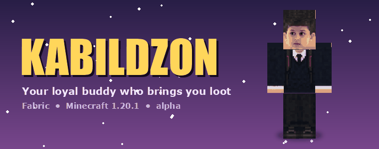
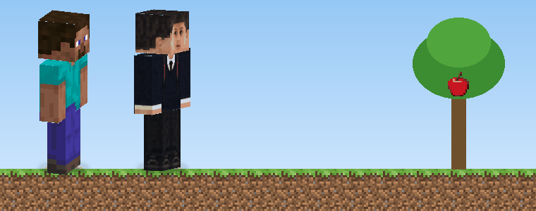
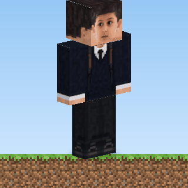
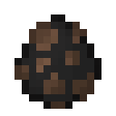
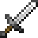

<div align="center">




**Kabildzon** — верный напарник для Minecraft.<br/>
Ходит за тобой, защищает в бою и приносит всё, что упало на землю.

</div>

---

## 🍎 Возможности

<table>
<tr>
<td width="55%">



</td>
<td>

### Приносит предметы
Яблоко упало с дерева, с моба выпал лут или ты сам что-то выбросил — Kabildzon подбежит, подберёт предмет и отдаст его тебе прямо в инвентарь.

Передавая предмет, он проигрывает свой звук 🔊

</td>
</tr>
<tr>
<td>

### Надёжный компаньон
- 🚶 Следует за хозяином и телепортируется к нему, если отстал
- ⚔️ Атакует твоих врагов и защищает тебя
- 🪑 Остаётся на месте по команде
- 💔 Издаёт свой звук при получении урона
- 🥇 Всегда держит слиток золота в левой руке — он выпадает, если Kabildzon погибнет

</td>
<td width="45%">



</td>
</tr>
</table>

---

## 🎮 Управление

| | Действие | Как сделать |
|:-:|---|---|
|  | **Призвать** | `Kabildzon Egg` во вкладке «Яйца призыва» или команда `/summon companion:companion` |
|  | **Приручить** | ПКМ **яблоком** — шанс 1 к 3, при успехе появятся сердечки ❤️ |
| ✋ | **Посадить / поднять** | ПКМ пустой рукой |
| 🍖 | **Вылечить** | ПКМ любой едой |
|  | **Звук меча** | Возьми любой меч в руку — звук услышат все игроки рядом |

---

## 📦 Установка

1. Установи **[Fabric Loader](https://fabricmc.net/use/)** для Minecraft **1.20.1**.
2. Положи в папку `mods`:
   - **[Fabric API](https://modrinth.com/mod/fabric-api)** для версии 1.20.1;
   - `kabildzon-x.x.x.jar` — свежая сборка во вкладке **Actions → последний запуск → Artifacts**.
3. Запусти игру и найди яйцо в творческом инвентаре 🥚

---

## 🛠️ Сборка из исходников

```bash
# требуется JDK 17
gradle build
# готовый файл: build/libs/kabildzon-<version>.jar
```

<details>
<summary>📁 Расположение ассетов</summary>

| Файл | Назначение |
|---|---|
| `assets/companion/textures/entity/companion.png` | HD-скин 512×512 (развёртка игрока) |
| `assets/companion/sounds/companion/give.ogg` | звук передачи предмета |
| `assets/companion/sounds/companion/hurt.ogg` | звук получения урона |
| `assets/companion/sounds/companion/sword_draw.ogg` | звук доставания меча |

</details>

<div align="center">

<sub>Сделано с ❤️ и яблоками</sub>

</div>
